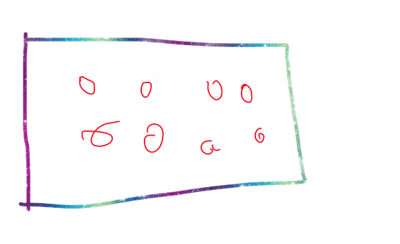

# MijnUnityProject

## v00rbereiding

**ik ga een soort plingo game maken die een score bij houd op basis van hoever hij vanaf het midden eidigt**

**week 1 was vrij makkelijk we hebben het vooral gehad over wat we moesten doen en we hebben daar een begin aan gemaakt**

Titel (werktitel)

- bal eeter

Genre

- Physics-based arcade puzzelgame.

Beschrijving

- je schiet random derectie een bal af en hoe verder je van het midden bent des te meer punten je hebt 

Gameplaykern

- Bal: een sphere
- Targets of bumps: cylinders
- Score: als je aan het eind de grond raakt des te verder je bent des te meer punten heb je 
- Doel: als ej 500 punten hebt in zoveel ballen
- Stijl en sfeer
donker thema mogenlijk zwart met regenboog 

Structuur van het level
- Bovenaan: schietplek.
- Midden: veld met targets.
- Onderaan: opvang of doelgebied voor het einde van de beurt.
