# MijnUnityProject

## Module 1
### oefening 1.1 

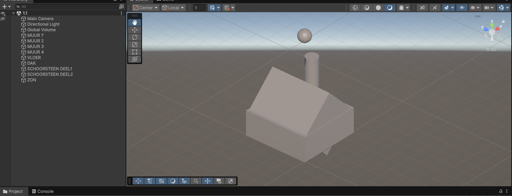

**we zijn begonnen met wat kleine dingen zoals een huis bouwen dit hebben we gedaan met transform en rect tool zoals je ziet bestaat het huisje uit**
   - 4 Cubes voor de muren
   - 1 Cube voor de vloer (maak deze platter met Scale)
   - 1 Cube voor het dak (draai 45 graden)
   - 2 Cylinders voor schoorstenen
   - 1 Sphere als decoratie (zon of lamp)

---
### oefening 1.2 

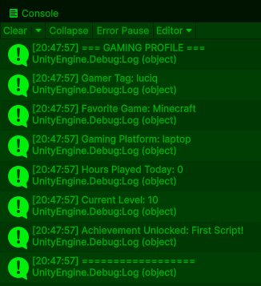

**ik ben begonnen met de voorgeschoten code en heb deze gepersonaliseerd tot wat het nu is**
- dit is waar ik mee begon 
```
void Start()
    // Gaming profiel informatie
    Debug.Log("=== GAMING PROFILE ===");
    Debug.Log("Gamer Tag: YourNameHere");
    Debug.Log("Favorite Game: Minecraft");
    Debug.Log("Gaming Platform: PC");
    Debug.Log("Hours Played Today: 3");
    Debug.Log("Current Level: 42");
    Debug.Log("Achievement Unlocked: First Script!");
    Debug.Log("==================");
```
- en dit is waar ik mee eindigde 
```
    Debug.Log("=== GAMING PROFILE ===");
    Debug.Log("Gamer Tag: luciq");
    Debug.Log("Favorite Game: Minecraft");
    Debug.Log("Gaming Platform: laptop");
    Debug.Log("Hours Played Today: 0");
    Debug.Log("Current Level: 10");
    Debug.Log("Achievement Unlocked: First Script!");
    Debug.Log("==================");
```
[de code file die ik heb gebruikt voor het draaien van het muntje](assets/scripts/module%201/CoinSpin.cs)

---
### oefening 2.1


**de code die ik heb gebruikt heb ik uit me duim gezogen met behulp van ai ik heb wel nageken wat de code doet en kan de code uitleggen**

[de code file die ik heb gebruikt voor het draaien van het muntje](assets/scripts/module%201/CoinSpin.cs)

---
### oefening 2.2

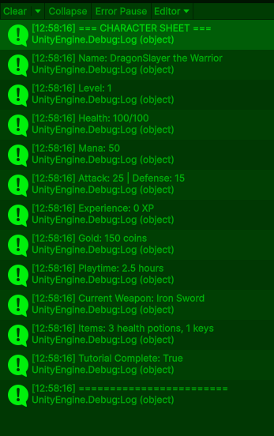

**deze code is voorgeschoten door de opdracht**

hier heb ik eigenlik niets aan verandert 

[de code file die ik heb gebruikt voor het laten zien van de character sheet ](assets/scripts/module%201/PlayerStats.cs)

---

### oefening 3.1a
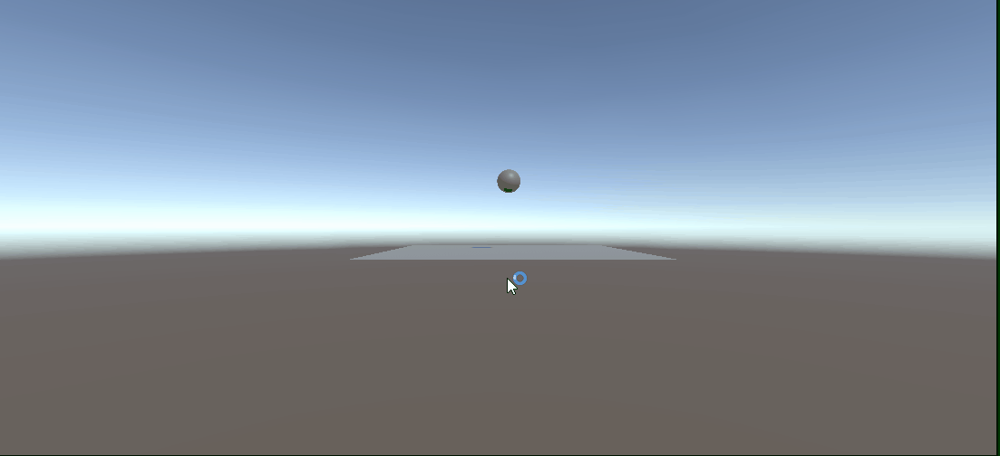

**ik heb de bounciness verandert in een physics material die heb ik toegepast bij bijde objecten zodat de bal oneindig stuitert**
>zie hieronder

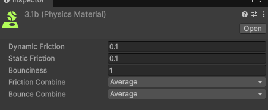

---
### oefening 3.1c
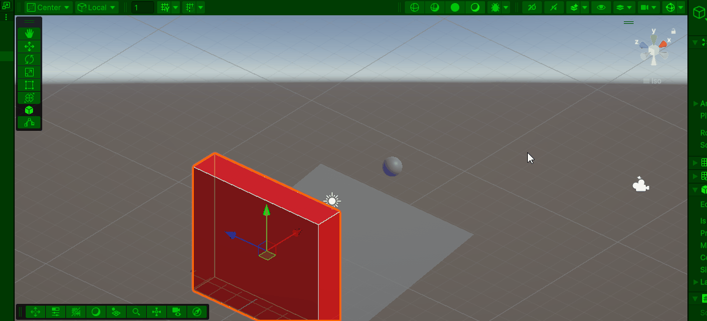

**ik heb een script gemaakt dat de kleur verandert van de muur op basis van een colision** 

[de code file die ik heb gebruikt voor het laten veranderen van de kleur van de muur  ](Assets\scripts\module%201/Colision.cs)

---
### oefening 3.2
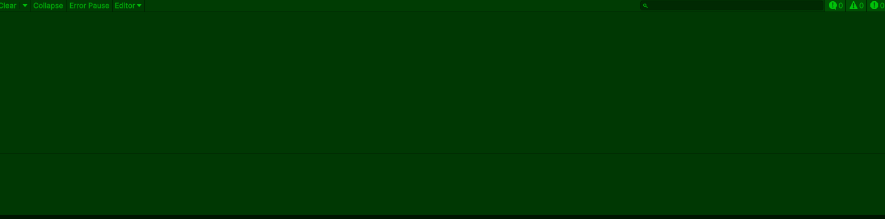

**je ziet hier heel kort hoe die opteeld je bestuurt het door de A en B toets te gebruiken en met W dan laat hij de score zien en vertelt hij wie gewonnen heeft**

[de code file die ik heb gebruikt voor het laten veranderen van de kleur van de muur  ](Assets\scripts/module%201/ScoreCalculator.cs)

---
### oefening 4.1a


**de code is bestuurbaar met zoals gevraagt h en j h voor damage en j voor healing**

- een if-structuur past hier goed omdat je voor elke log moet kijken of je health onder een bepaalde hoeveelheid is 

- een switch zou ook kunnen werken omdat je dan hoeveelheid health kan koppelen aan een massage 

[de code file die ik heb gebruikt voor het laten zien van de code](Assets\scripts/module%201/HealthStatus.cs)

---
### oefening 4.1b


**het uitbrijden was vrij makkelijk ik heb een script gemaakt dat op de player wordt toegepast het kijkt naar of het object een ```Enemy``` tag heeft en gebruikt deze om de scene te herstarten en een punt van de health af te halen**

[de code file die ik heb gebruikt voor de player](Assets\scripts/module%201/PlayerHealth.cs)

--- 
### oefening 4.1c 

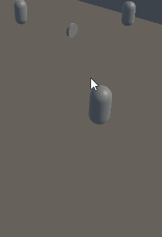

**ik heb een script toegevoegt aan een Enemy die hem om een parent object heen laat draaien**

[de code file die ik heb gebruikt voor het boo script](Assets\scripts/module%201/BooScript.cs)

---
### oefening 4.2 

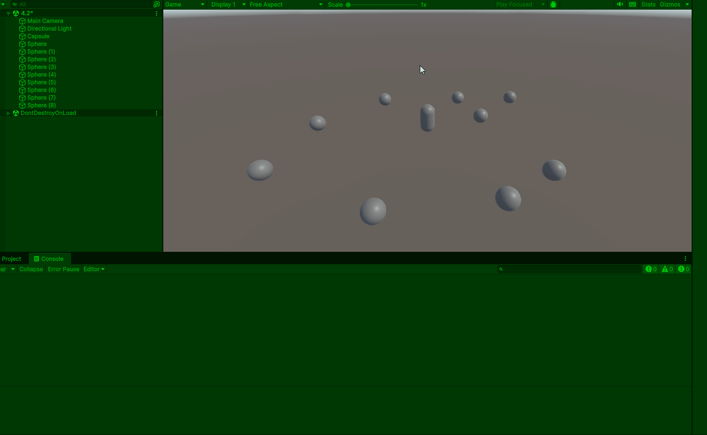

**ik heb een script gemaakt die kijkt of een object een coin tag heeft en houdt op basis daarvan een score bij**

[coin collector](Assets\script/module%201/Pickup.cs)

---
### oefening 5.1 a

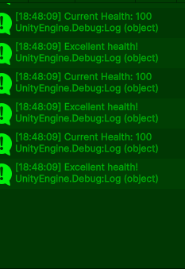

**de code is bestuurbaar met zoals gevraagt h en j h voor damage en j voor healing**

- een if-structuur past hier goed omdat je voor elke log moet kijken of je health onder een bepaalde hoeveelheid is 

- een switch zou ook kunnen werken omdat je dan hoeveelheid health kan koppelen aan een massage 

[de code file die ik heb gebruikt voor het laten zien van de code](Assets\scripts/module%201/HealthStatus.cs)

--- 
### oefening 5.1 b 

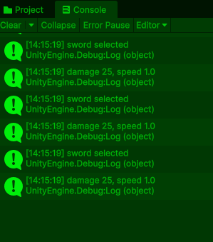

**het werkt zoals het werkt je stuurd het aan met Q, W, E, R en T**

[de code file die ik heb gebruikt voor de switch](Assets\scripts/module%201/WeaponSwitch.cs)

---
### oefening 5.1c


**ik heb gedaan zoals de opdracht vroeg en heb een enum toegevoegd**

[de code file die ik heb gebruikt voor de switch + de enum](Asssets\scripts/module%201/WeaponSwitchEnum.cs)

---
### oefening 5.2

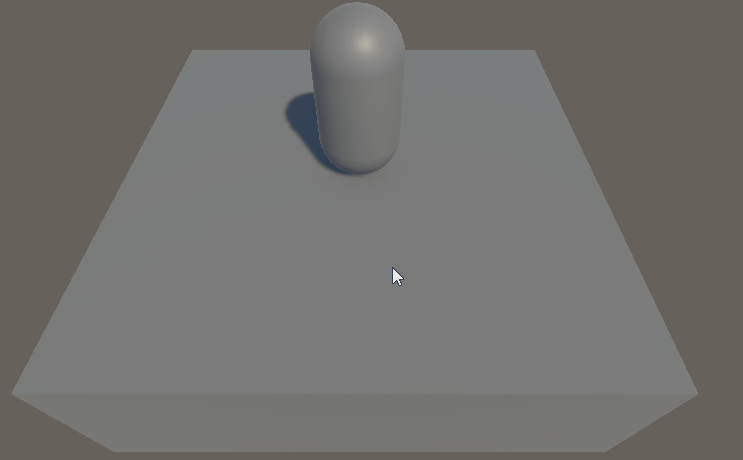

**ik heb een script gemaakt dat de renderer neemt van het opject en kijkt of het een player is die erop staat als dat zo is kan je met R,G en B de kleur veranderen**

[de code file die ik heb gebruikt voor het laten veranderen van de kleur](Assets\scripts/module%201/ColorChanger.cs)

---
### oefening 6.1

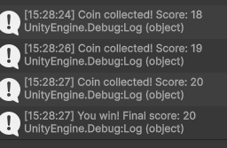
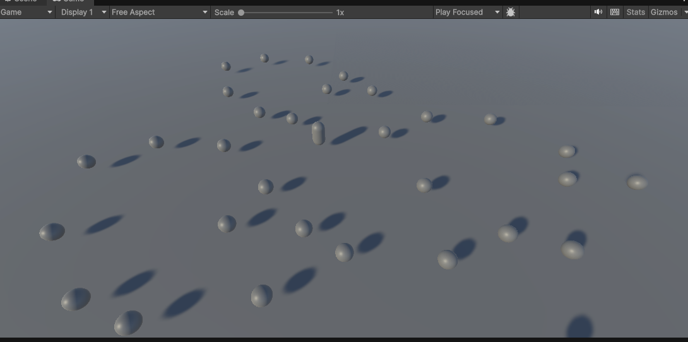

**ik heb een plane heel groot gemaakt voor de vloer hier heb ik 30+ spheres op gezet en een player die de spheres kan oppakken met als eind 20 punten**

[de code file die ik heb gebruikt voor het oppaken van de spheres](Assets\scripts/module%201/pickup.cs)

## Module 2
### oefening 1A

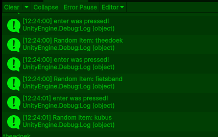

**ik heb het heel simpel gedaan door een array te maken met de naam `itemName` deze heb ik 10 random dingen gegeven als string values hierna heb ik het gemaakt dat als ik met `enter` klik dat ik dan 1 item Log als je `esc` klikt geeft hij heel de lijst in apparte logs**

[de code file die ik heb gebruikt voor het loggen en maken van de array op basis van input](Assets\scripts/module%202/RandomItem%20(1A).cs)